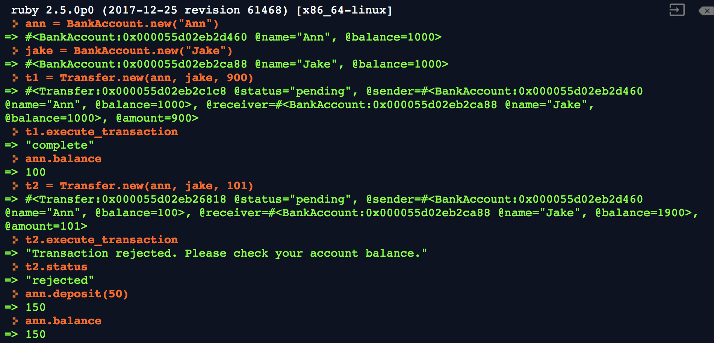

Let's revisit OO in both Ruby and in JavaScript.

We have successful created a CLI-like banking application in Ruby. Open `bank.rb` and see the below screen shot:

* (1) We create two bank accounts, one for Ann and one for Jake. Both accounts start at $1000.

* (2) We create the first transfer which is t1, where Ann gives $900 to Jake. Then, we successfully execute this transfer, and Ann's new balance is $100.

* (3) We create the second transfer which is t2, where Ann gives $101 to Jake. But when we try to execute this transfer, it is rejected because Ann does not have enough money.

* (4) We then deposit $50 into her account. Her new balance is $150.

We tried to implement the same application in JavaScript, but something are wrong. Can you fix them?
